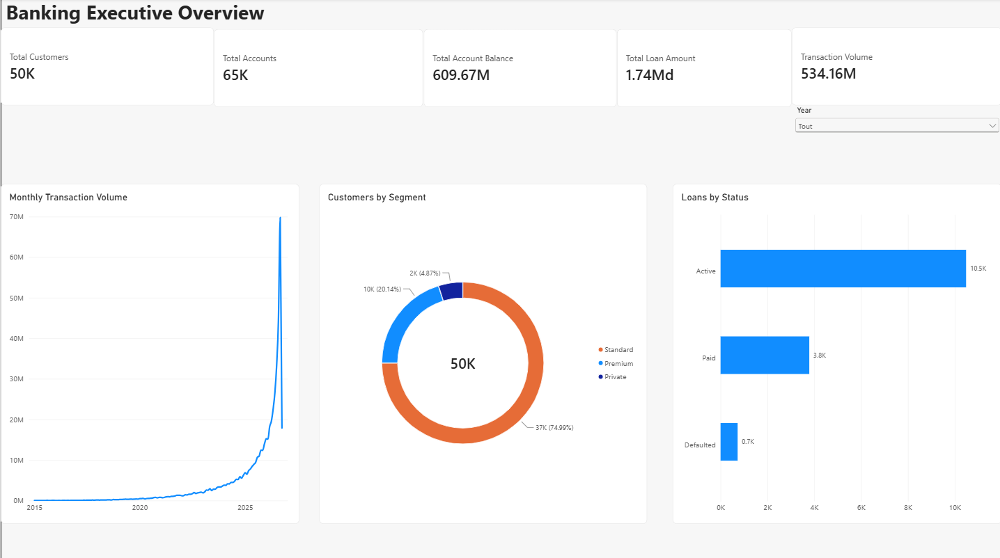
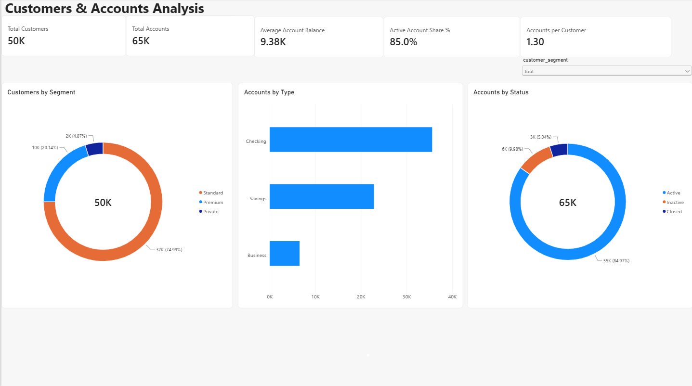
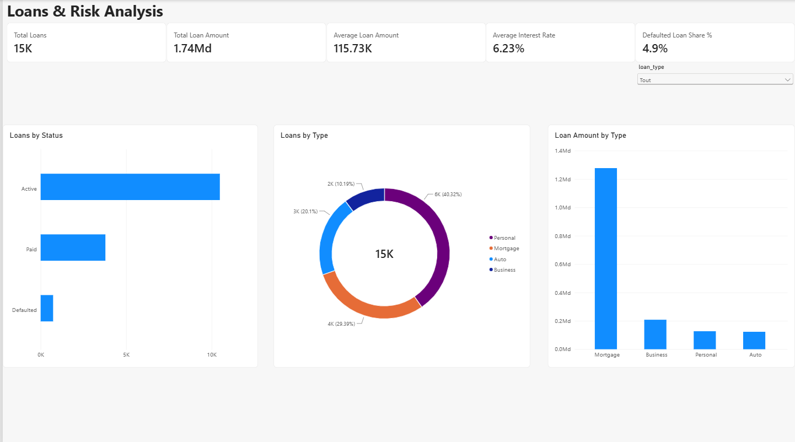
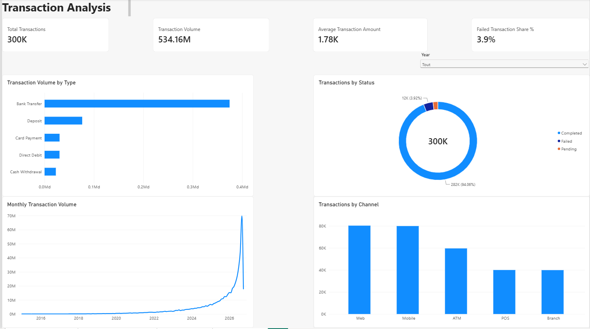

# Banking Data Management & BI Analytics

End-to-end Data Management and Business Intelligence project simulating a banking data environment.

The project demonstrates how raw synthetic banking data can be generated, validated, cleaned, stored in PostgreSQL, analyzed with SQL, and prepared for interactive reporting in Power BI.

## Project Overview

The project covers the complete data lifecycle:

```text
Synthetic Banking Data
        ↓
Python Data Generation
        ↓
Data Quality Validation
        ↓
Data Cleaning & Rejection
        ↓
Certified Datasets
        ↓
PostgreSQL
        ↓
SQL Analytics & BI Views
        ↓
Power BI Dashboard
```

The dataset includes:

- Customers
- Branches
- Accounts
- Loans
- Transactions

> **Note:** All data in this project is synthetic. It does not contain real customer information and does not represent actual Belgian banking statistics.


## Tech Stack

| Area | Technologies |
|---|---|
| Programming | Python |
| Data Processing | pandas, NumPy |
| Synthetic Data Generation | Faker |
| Data Quality | Python validation and cleaning pipelines |
| Database | PostgreSQL |
| SQL | Data modeling, constraints, joins, aggregations, CTEs, views |
| Business Intelligence | Power BI, DAX |
| Version Control | Git & GitHub |
| Development Environment | VS Code |


## Project Architecture

The project follows a layered data architecture separating raw data, data quality processing, certified datasets, database storage, analytics, and reporting.

```text
┌─────────────────────────────┐
│ Synthetic Data Generation   │
│ Python + Faker + NumPy      │
└──────────────┬──────────────┘
               ↓
┌─────────────────────────────┐
│ Raw Banking Data            │
│ data/raw/                   │
└──────────────┬──────────────┘
               ↓
┌─────────────────────────────┐
│ Data Quality Validation     │
│ Python validation rules     │
└──────────────┬──────────────┘
               ↓
┌─────────────────────────────┐
│ Cleaning & Rejection        │
│ Valid / Rejected records    │
└──────────────┬──────────────┘
               ↓
┌─────────────────────────────┐
│ Certified Data              │
│ data/processed/             │
└──────────────┬──────────────┘
               ↓
┌─────────────────────────────┐
│ PostgreSQL                  │
│ PK / FK / CHECK constraints │
└──────────────┬──────────────┘
               ↓
┌─────────────────────────────┐
│ SQL Analytics & BI Views    │
│ KPIs / CTEs / Views         │
└──────────────┬──────────────┘
               ↓
┌─────────────────────────────┐
│ Power BI                    │
│ Data Model / DAX / Dashboard│
└─────────────────────────────┘
```


## Data Quality Pipeline

The project implements dedicated validation and cleaning pipelines for the main banking entities.

Data quality controls include:

- Primary key duplicate detection
- Missing required values
- Invalid categorical values
- Invalid numeric ranges
- Future date detection
- Temporal consistency checks
- Referential integrity checks
- Transaction type / channel consistency
- Customer, account, loan, and transaction relationship validation

Invalid records are separated from certified records and documented with rejection reasons.

### Certified Reference Data

Child datasets are validated against certified parent datasets rather than raw reference data.

```text
Clean Customers
      ↓
Clean Accounts
      ↓
Clean Transactions

Clean Customers + Valid Branches
      ↓
Clean Loans
```

This prevents records from being considered valid when they reference a parent record that was rejected during an earlier data quality stage.

PostgreSQL provides an additional integrity layer through primary keys, foreign keys, and CHECK constraints.


## PostgreSQL & SQL Analytics

The certified banking datasets are loaded into PostgreSQL, where database-level constraints provide an additional layer of data integrity.

The relational schema includes:

- `customers`
- `branches`
- `accounts`
- `loans`
- `transactions`

Database controls include:

- Primary keys
- Foreign keys
- NOT NULL constraints
- CHECK constraints
- Referential integrity

### SQL Analytics

The analytical SQL layer includes 13 business-oriented queries covering:

- Executive banking KPIs
- Customer segmentation
- Account portfolio analysis
- Loan portfolio and status analysis
- Transaction type and channel analysis
- Monthly transaction trends
- Branch performance
- Customer risk distribution
- Loan exposure by risk category

### BI Reporting Views

A dedicated SQL reporting layer provides reusable PostgreSQL views:

- `vw_customer_profile`
- `vw_account_portfolio`
- `vw_loan_portfolio`
- `vw_transaction_details`
- `vw_branch_performance`

The branch performance view aggregates account and loan metrics separately before joining them to the branch dimension, preventing many-to-many row multiplication and double counting.


## Power BI Dashboard

### Dashboard Preview

#### Executive Overview


#### Customers & Accounts


#### Loans & Risk


#### Transactions


The Power BI reporting layer has been designed and documented and will be implemented in Power BI Desktop.

The dashboard is structured into four analytical pages:

1. **Executive Overview** — high-level banking KPIs and portfolio activity
2. **Customers & Accounts** — customer segmentation and account portfolio analysis
3. **Loans & Risk** — loan portfolio, status, and synthetic risk analysis
4. **Transactions** — transaction activity, channels, types, and status analysis

The planned Power BI model includes:

- One-to-many relationships
- Single-direction filtering
- Dedicated Date dimension
- Explicit DAX measures
- Interactive slicers
- KPI cards
- Time-series and categorical analysis

Detailed Power BI model design, relationships, DAX measures, and dashboard specifications are documented in `powerbi/README.md`.

> **Status:** Dashboard design completed. Power BI Desktop implementation is pending.


## Repository Structure

```text
banking-data-management/
│
├── data/
│   ├── raw/                 # Generated raw banking datasets
│   ├── processed/           # Certified and rejected datasets
│   └── quality_reports/     # Data quality validation reports
│
├── docs/
│   └── data_dictionary.md   # Banking data dictionary
│
├── images/                  # Dashboard and project screenshots
│
├── powerbi/
│   └── README.md            # Power BI model, DAX and dashboard design
│
├── python/
│   ├── generate_data.py
│   ├── validate_*.py
│   ├── clean_*.py
│   └── inject_*_anomalies.py
│
├── sql/
│   ├── 01_create_schema.sql
│   ├── 02_analytics.sql
│   └── 03_views.sql
│
├── .gitignore
├── requirements.txt
└── README.md
```


## Getting Started

### 1. Clone the Repository

```bash
git clone https://github.com/abdelkadirmdaouadji-hub/banking-data-management.git
cd banking-data-management
```

### 2. Create a Python Virtual Environment

```bash
python3 -m venv .venv
source .venv/bin/activate
```

### 3. Install Python Dependencies

```bash
python -m pip install -r requirements.txt
```

### 4. Generate the Synthetic Banking Data

```bash
python python/generate_data.py
```


### 5. Run Data Quality Validation

Run the validation scripts to evaluate the generated datasets:

```bash
python python/validate_customers.py
python python/validate_branches.py
python python/validate_accounts.py
python python/validate_loans.py
python python/validate_transactions.py
```

Validation results are written to:

```text
data/quality_reports/
```

### 6. Create Certified Datasets

Run the cleaning pipelines to separate valid records from rejected records:

```bash
python python/clean_customers.py
python python/clean_accounts.py
python python/clean_loans.py
python python/clean_transactions.py
```

The certified datasets are written to:

```text
data/processed/
```

Branches are validated directly and used as the certified branch reference dataset.


### 7. Create the PostgreSQL Database

Create the project database:

```bash
createdb banking_db
```

Create the relational schema and database constraints:

```bash
psql -d banking_db -f sql/01_create_schema.sql
```

### 8. Load the Certified Data

Load the certified datasets into PostgreSQL using `\copy`.

The expected source mapping is:

| PostgreSQL Table | Source Dataset |
|---|---|
| `customers` | `data/processed/customers.csv` |
| `branches` | `data/raw/branches.csv` |
| `accounts` | `data/processed/accounts_clean.csv` |
| `loans` | `data/processed/loans_clean.csv` |
| `transactions` | `data/processed/transactions_clean.csv` |

Example:

```bash
psql -d banking_db -c "\copy customers FROM 'data/processed/customers.csv' WITH (FORMAT csv, HEADER true)"
```

Repeat the load for the remaining tables in dependency order:

```text
customers
branches
accounts
loans
transactions
```

### 9. Create the BI Reporting Views

```bash
psql -d banking_db -f sql/03_views.sql
```

### 10. Run the SQL Analytics

```bash
psql -d banking_db -f sql/02_analytics.sql
```


## Data Quality Testing

The project includes anomaly injection scripts used to test the effectiveness of the validation and cleaning pipelines.

Examples of injected anomalies include:

- Duplicate identifiers
- Missing mandatory values
- Invalid customer and branch references
- Negative financial amounts
- Invalid account, loan, and transaction statuses
- Future dates
- Invalid transaction type / channel combinations
- Transactions occurring before account opening dates

The anomaly injection scripts are located in:

```text
python/inject_*_anomalies.py
```

These scripts generate intentionally corrupted test datasets. The validation pipelines are then executed against those datasets to confirm that the expected data quality issues are detected.

This testing approach keeps intentionally corrupted test data separate from the certified datasets used for PostgreSQL and BI reporting.


## Dataset Summary

After data quality validation, cleaning, and referential integrity enforcement, the certified PostgreSQL database contains:

| Dataset | Certified Records |
|---|---:|
| Customers | 49,989 |
| Branches | 25 |
| Accounts | 64,978 |
| Loans | 14,996 |
| Transactions | 299,893 |

Additional portfolio metrics:

| Metric | Value |
|---|---:|
| Total Account Balance | 609,665,953.17 |
| Total Loan Amount | 1,735,493,756.45 |
| Transaction Volume | 534,164,969.13 |

> These figures describe the synthetic dataset generated for this project. Financial amounts and distributions should not be interpreted as real banking performance or market statistics.


## Key Project Highlights

- Built an end-to-end banking data pipeline from synthetic data generation to BI-ready datasets.
- Implemented reusable Python validation and cleaning pipelines with explicit rejection reasons.
- Enforced referential integrity across customers, accounts, loans, transactions, and branches.
- Used certified parent datasets to validate dependent child datasets.
- Added PostgreSQL primary keys, foreign keys, and CHECK constraints as a second data integrity layer.
- Developed 13 SQL analytical queries covering portfolio, customer, risk, branch, and transaction analysis.
- Created reusable PostgreSQL views for BI reporting.
- Prevented double counting in branch-level reporting by aggregating account and loan metrics before joining them.
- Designed a Power BI semantic model with explicit DAX measures, controlled filter directions, and a dedicated Date dimension.
- Used anomaly injection to test and demonstrate the effectiveness of data quality controls.


